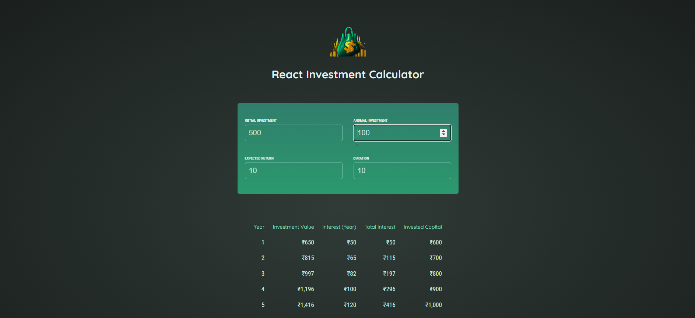

# Investment Calculator

In thise react web we tack below values as user input :
     
      Initial Investment
      Annula Investment
      Expected Return
      Duration In Years

And calculate the below value for each year 

      Current invetment value Investment Value 	
      Interest Gain per Year	
      Total Interest Gain	
      Total invested Capital
      
And show them in a table. 

## Tech Stack 
    -> React js
    -> CSS 
    -> javascript

## Reactjs Concept Used: 

-> Hooks

React hooks are the built in react components which is used to rerender the component when some state chganges in that component.

I have used useState Hook to change the state        dynamicaly when user inputs some data. 
   
-> Two way Data Binding Binding:

The  concept of two way binding is used when user inters data then using useState hook at the same time we channge the value of the input filed 

-> Lifting Up the State:

Lifting up the state means getting some data form the child componene to parent component using callback function.
In this project we have lifted up the state from Calculator_input component to App component.

-> Conditional Rendering: 
   
I have used conditional rendering while redering the result table if the duration interned in the input field is less then zero then it will show some message to enter the valid value 

## Live Project link: 

    https://investment-calculator-rose.vercel.app/  

    